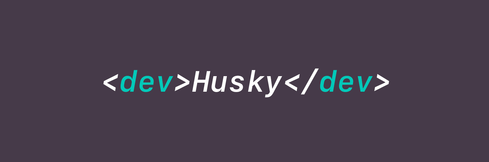

# Hi, I'm Olegas 

I'm a developer from Stockholm who is passionate about developing/building applications!

## Facts about me:

- :books: Currently studying in NTI High School.
- 👨‍💻 Intern in <a href="https://inosida.se">Inosida</a>.
-  :wolf: I love huskies.
- :musical_note: I love listening music.
- :e-mail: You can reach me by sevcenko.olegas@gmail.com.

## Working on

 
 
 
## Connect with me
 

 

## Stats

